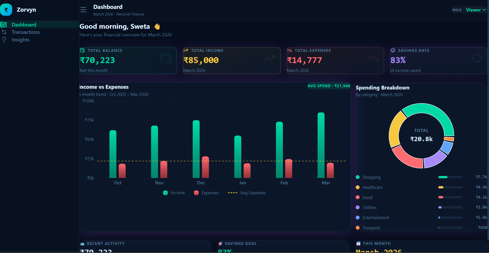

# FinTrack — Finance Dashboard UI

A clean, interactive personal finance dashboard built with React 19 and Tailwind CSS. 
Designed to help users track income, expenses, and understand their spending patterns 
through an intuitive and responsive interface.

## Live Demo
[View Live →](https://finance-dashboard-mu-seven.vercel.app/)

## Preview


---

## Tech Stack

- **React 19** — component-based UI
- **Vite** — fast development build tool
- **Tailwind CSS v4** — utility-first styling
- **Recharts** — data visualizations
- **Lucide React** — icon library
- **React Hot Toast** — notification system

---

## Features

### Core Requirements
- **Dashboard Overview** — summary cards with animated counters, 6-month bar chart, spending donut chart
- **Transactions Section** — full transaction list with search, filter by type/category, and sort by date/amount
- **Role Based UI** — switch between Viewer (read only) and Admin (add, edit, delete transactions) using the role dropdown
- **Insights Section** — top spending category, month-over-month comparison table, category breakdown with progress bars
- **State Management** — centralized via React Context API managing transactions, filters, and role

### Optional Enhancements
- **Animated number counters** on stat cards for a premium feel
- **CSV Export** — download filtered transactions as a `.csv` file
- **Toast notifications** — feedback on every add, edit, and delete action
- **Gradient bar charts** with reference line showing average expenses
- **Interactive donut chart** — hover pulls out segments, center shows category total
- **Empty state handling** — friendly message when no transactions match filters
- **Responsive design** — works on all screen sizes

---

## Project Structure

src/
├── components/
│   ├── charts/
│   │   ├── BarChartView.jsx      # 6-month income vs expenses bar chart
│   │   └── PieChartView.jsx      # Spending breakdown donut chart
│   ├── Sidebar.jsx               # Collapsible navigation sidebar
│   ├── Topbar.jsx                # Header with role switcher
│   ├── StatCard.jsx              # Animated summary cards
│   ├── TransactionTable.jsx      # Filterable transaction list
│   ├── TransactionModal.jsx      # Add / edit transaction modal
│   └── Toast.jsx                 # Global toast notifications
├── context/
│   └── AppContext.jsx            # Global state management
├── data/
│   └── mockData.js               # Static mock transactions and chart data
├── pages/
│   ├── Dashboard.jsx             # Main overview page
│   ├── Transactions.jsx          # Transactions page
│   └── Insights.jsx              # Insights and analytics page
├── utils/
│   └── exportCSV.js              # CSV export utility
├── App.jsx
├── main.jsx
└── index.css


---

## Getting Started

### Prerequisites
- Node.js v18 or above
- npm

### Installation
```bash
# Clone the repository
git clone https://github.com/SwetaSharma2000/finance-dashboard

# Navigate into the project
cd finance-dashboard

# Install dependencies
npm install

# Start the development server
npm run dev
```

App will run at `http://localhost:5173`

---

## Role Based UI

| Feature | Viewer | Admin |
|---|---|---|
| View dashboard | ✅ | ✅ |
| View transactions | ✅ | ✅ |
| View insights | ✅ | ✅ |
| Add transaction | ❌ | ✅ |
| Edit transaction | ❌ | ✅ |
| Delete transaction | ❌ | ✅ |
| Export CSV | ✅ | ✅ |

Switch roles using the **Role** dropdown in the top right corner.

---

## State Management Approach

All application state lives in a single `AppContext` using React's built-in Context API and `useMemo` for derived state:

- `transactions` — source of truth for all transaction data
- `filteredTransactions` — derived from transactions + active filters
- `categorySpending` — derived for chart data
- `summary` — derived income, expenses, balance, savings rate
- `role` — controls UI permissions
- `search`, `filterType`, `filterCat`, `sortBy` — filter state

This approach was chosen for simplicity, readability, and to avoid unnecessary dependencies for a project of this scope.

---

## Assumptions Made

- All data is static and mock — no backend or API integration
- "March 2026" is used as the current active month for summary calculations
- Role switching is frontend-only for demonstration purposes
- CSV export applies to currently filtered transactions

---

Built with ❤️ by Sweta Sharma